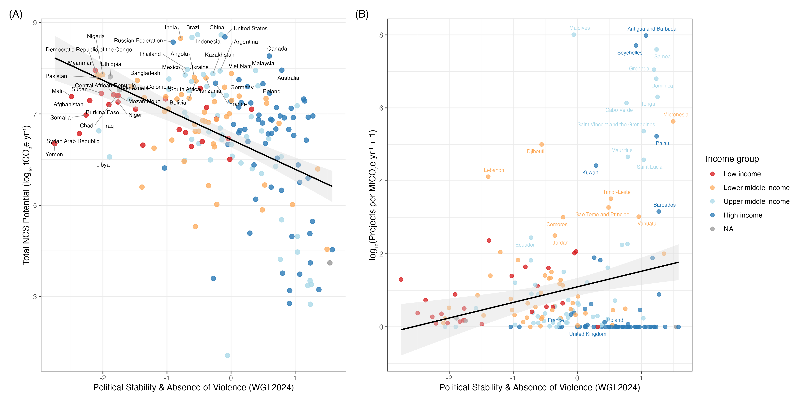
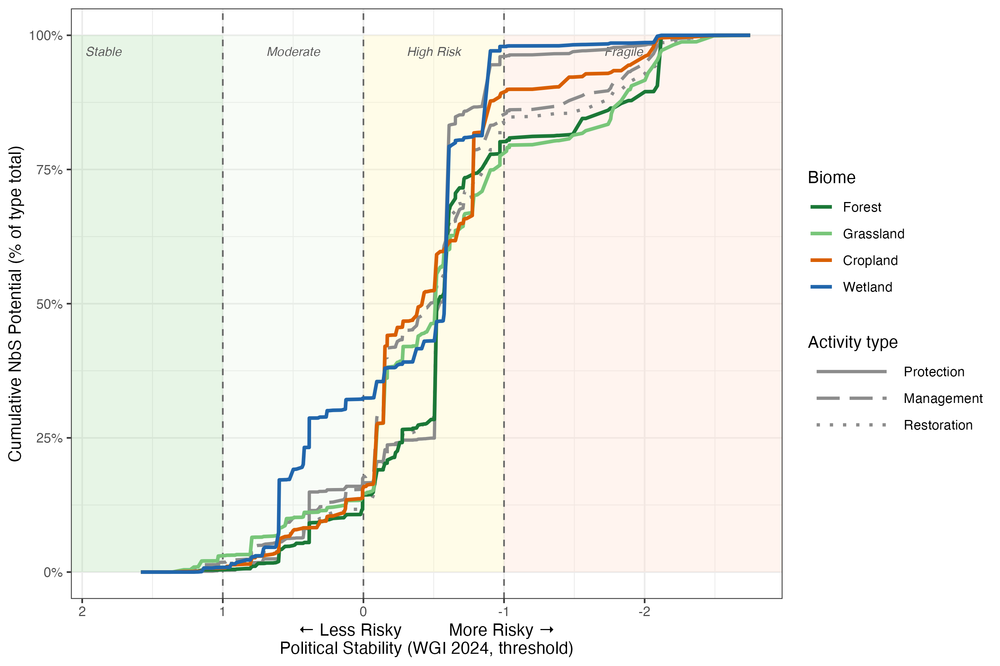

```{r setup, include=FALSE}
knitr::opts_chunk$set(echo = FALSE, warning = FALSE, message = FALSE)
knitr::opts_knit$set(root.dir = normalizePath(
  file.path(knitr::current_input(dir = TRUE), "..")
))
```

## Methods

**Data sources.** We integrated three country-level datasets. First, we used
biophysical NbS mitigation potential estimates from Naturebase v3 (The Nature
Conservancy, 2025), which provides annual sequestration and avoided-emission
potential in tCO~2~e yr^-1^ across 20 pathways spanning cropland, forest,
grassland and wetland ecosystems for 216 countries. We focused on the total NCS
potential per country, the sum across all 20 pathways, as well as biome-level
totals (cropland, forest, grassland, wetland) and activity-type totals
(protection, management, restoration).

Second, we measured political risk using the World Governance Indicators (WGI)
2024 release (World Bank). We used the Political Stability and Absence of
Violence/Terrorism dimension (PV.EST; scale −2.5 to +2.5) as our primary measure
of political risk, with lower scores indicating higher instability and conflict
exposure. We also ran sensitivity analyses using all six WGI dimensions (Voice
& Accountability, Government Effectiveness, Regulatory Quality, Rule of Law, and
Control of Corruption).

Third, we constructed two complementary measures of NbS project implementation.
*Market-based implementation* was measured using the global database of
nature-based carbon offset project boundaries (Karnik et al., 2024;
doi:10.5281/zenodo.11459391), which catalogues 575 georeferenced projects across
55 countries from six carbon registries (Verra, *n* = 294; Climate Action Reserve,
*n* = 134; American Carbon Registry, *n* = 96; EcoRegistry, *n* = 33; Gold
Standard, *n* = 17; BioCarbon Registry, *n* = 1), spanning three project types:
Improved Forest Management (IFM, *n* = 252), Afforestation/Reforestation/
Revegetation (ARR, *n* = 190), and Avoided Deforestation (AD, *n* = 133).
*Community-based implementation* was measured using the UNDP Equator Initiative
Solutions Database, scraped via the WordPress REST API (July 2025), yielding
2,351 community NbS initiatives across 140 countries with geolocation data.

**Analytical approach.** We matched NbS potential data with WGI scores for 189
countries. To measure *implementation efficiency* — the degree to which countries
translate biophysical carbon opportunity into actual projects — we computed total
projects (market + community) per MtCO~2~e yr^-1^ of NbS potential for each
country. Both NbS potential and the efficiency ratio were log~10~-transformed prior
to analysis to account for right-skewed distributions. We estimated bivariate
relationships using Spearman rank correlations (robust to non-normality) and
ordinary least-squares regressions controlling for income group (World Bank
classification). All analyses were conducted in R 4.6.0.

To examine how political risk constrains the *accessible* NbS portfolio under
different risk tolerances, we constructed cumulative potential curves for each NbS
type. Countries were sorted from most to least politically stable (descending
PV.EST) and cumulative NbS potential was computed as each successive country was
added. The resulting curves — expressed as a percentage of global type-level total
— show the share of potential accessible if an investor or policymaker limits
engagement to countries above a given stability threshold. We report this
separately for four biome types (cropland, forest, grassland, wetland) and three
activity types (protection, management, restoration), with risk zones defined at
PV.EST thresholds of −1 (fragile), 0 (average), and +1 (stable).

---

## Results

**The carbon opportunity is disproportionately located in high-risk countries.**
Figure 1A shows a significant negative relationship between NbS biophysical
potential and political stability (Spearman *ρ* = −0.47, *p* < 0.001): countries
with the largest total carbon sequestration and avoided-emission potential —
principally in the Congo Basin, Amazon, and Southeast Asia — tend to have
substantially lower political stability scores. This is not coincidental; tropical
forest ecosystems, which harbour the majority of global NbS potential, are
concentrated in regions that are also among the most politically fragile.

**Despite this, stable countries implement more efficiently.** Figure 1B reveals
the implementation gap: when project counts are normalised by biophysical potential
(projects per MtCO~2~e yr^-1^), the relationship with political stability reverses
to positive. High-stability countries implement substantially more projects per unit
of available carbon opportunity than their higher-risk counterparts. This
divergence — potential inversely related to stability, but efficiency positively
related — is the core tension motivating this paper: the places with the most to
offer are systematically underserved by NbS investment.

**The risk barrier is sharpest for protection and forest-type NbS.** Figure 2
disaggregates this result by NbS type. Protection-type activities show the steepest
cumulative curve, meaning that their potential is most concentrated in fragile and
high-risk countries: less than 25% of global protection potential lies in countries
with above-average stability (PV > 0). Forest NbS follows a similar pattern, with
the bulk of potential entering the cumulative total only as the fragile zone is
included. By contrast, cropland and management-type activities show gentler curves,
accumulating more potential in moderate- and low-risk countries, suggesting
relatively greater opportunities for implementation without entering fragile
contexts.

**Practical implications.** For investors and policy-makers operating with strict
risk constraints — accepting only countries with PV > 0 — the accessible global NbS
portfolio is substantially truncated, and predominantly cropland and management
activities. Accessing the full scale of forest protection and wetland conservation
potential requires either accepting higher political risk or deploying risk
mitigation instruments (political risk insurance, sovereign guarantees, blended
finance) specifically targeted at fragile and conflict-affected states.

---

## Figure 1

**Figure 1.** Political stability and NbS biophysical potential and implementation
efficiency across 189 countries. **(A)** Country-level total NbS mitigation
potential (Naturebase v3, 2025) as a function of political stability (WGI
Political Stability & Absence of Violence, 2024). Countries are coloured by World
Bank income group. The black line shows an OLS regression fit with 95% confidence
interval (Spearman *ρ* = −0.47, *p* < 0.001). High-potential countries are
disproportionately concentrated among lower-income, less stable nations.
**(B)** NbS implementation efficiency — total projects (market-based carbon offset
projects, Karnik et al. 2024, *n* = 575; and community-based NbS initiatives,
Equator Initiative 2024, *n* = 1,677 with location data) per MtCO~2~e yr^-1^ of
biophysical potential — as a function of political stability. Countries with high
NbS potential but zero recorded projects are labelled. The positive slope indicates
that more politically stable countries implement more projects relative to their
available carbon opportunity, despite holding less absolute potential.

```{r fig1}

```

---

## Figure 2

**Figure 2.** Cumulative NbS mitigation potential accessible as a function of
political risk tolerance. The x-axis represents a minimum political stability
threshold (WGI PV.EST, 2024): reading left-to-right, progressively higher-risk
countries are included. The y-axis shows the cumulative potential of each NbS type
as a percentage of its global total. Coloured lines represent four **biome types**
(Forest, Grassland, Cropland, Wetland; Naturebase v3, 2025). Grey lines represent
three **activity types** (Protection: solid; Management: long-dash; Restoration:
dotted). Shaded risk zones correspond to Stable (PV > 1), Moderate (0 < PV ≤ 1),
High Risk (−1 < PV ≤ 0), and Fragile (PV < −1) country classifications. Steeper
curves indicate greater concentration of potential in high-risk countries.

```{r fig2}

```

---

## References

Karnik, A., Kilbride, J., Goodbody, T., Rachel, R. & Ayrey, E. (2024). *A global
database of nature-based carbon offset project boundaries* [Dataset]. Zenodo.
https://doi.org/10.5281/zenodo.11459391

The Nature Conservancy (2025). *Naturebase v3*. https://naturebase.org

UNDP Equator Initiative (2024). *Nature-Based Solutions Database*.
https://www.equatorinitiative.org/knowledge-center/nature-based-solutions-database/

World Bank (2024). *Worldwide Governance Indicators*.
https://www.worldbank.org/en/publication/worldwide-governance-indicators
